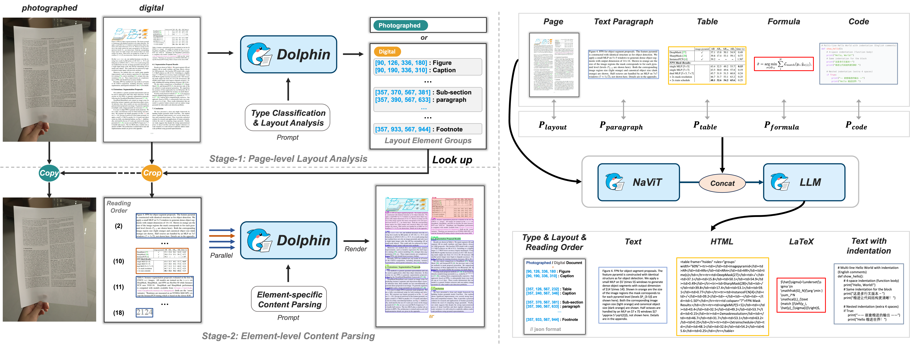

<div align="center">
  
</div>

<div align="center">
  <a href="https://arxiv.org/abs/2505.14059">
    
  </a>
  <a href="https://huggingface.co/ByteDance/Dolphin">
    
  </a>
  <a href="https://modelscope.cn/models/ByteDance/Dolphin">
    
  </a>
  <a href="http://115.190.42.15:8888/dolphin/">
    
  </a>
  <a href="https://github.com/bytedance/Dolphin">
    
  </a>
  <a href="https://opensource.org/licenses/MIT">
    
  </a>
  <br>
</div>

<br>

<div align="center">
  
</div>

# Dolphin: Document Image Parsing via Heterogeneous Anchor Prompting

Dolphin (**Do**cument Image **P**arsing via **H**eterogeneous Anchor Prompt**in**g) is a novel multimodal document image parsing model following an analyze-then-parse paradigm. This repository contains the demo code and pre-trained models for Dolphin.

## 📑 Overview

Document image parsing is challenging due to its complexly intertwined elements such as text paragraphs, figures, formulas, and tables. Dolphin addresses these challenges through a two-stage approach:

1. **🔍 Stage 1**: Comprehensive page-level layout analysis by generating element sequence in natural reading order
2. **🧩 Stage 2**: Efficient parallel parsing of document elements using heterogeneous anchors and task-specific prompts

<div align="center">
  
</div>

Dolphin achieves promising performance across diverse page-level and element-level parsing tasks while ensuring superior efficiency through its lightweight architecture and parallel parsing mechanism.

## 🚀 Demo
Try our demo on [Demo-Dolphin](http://115.190.42.15:8888/dolphin/).

## 📅 Changelog
- 🔥 **2025.07.10** Released the *Fox-Page Benchmark*, a manually refined subset of the original [Fox dataset](https://github.com/ucaslcl/Fox). Download via: [Baidu Yun](https://pan.baidu.com/share/init?surl=t746ULp6iU5bUraVrPlMSw&pwd=fox1) | [Google Drive](https://drive.google.com/file/d/1yZQZqI34QCqvhB4Tmdl3X_XEvYvQyP0q/view?usp=sharing).
- 🔥 **2025.06.30** Added [TensorRT-LLM support](https://github.com/bytedance/Dolphin/blob/master/deployment/tensorrt_llm/ReadMe.md) for accelerated inference！
- 🔥 **2025.06.27** Added [vLLM support](https://github.com/bytedance/Dolphin/blob/master/deployment/vllm/ReadMe.md) for accelerated inference！
- 🔥 **2025.06.13** Added multi-page PDF document parsing capability.
- 🔥 **2025.05.21** Our demo is released at [link](http://115.190.42.15:8888/dolphin/). Check it out!
- 🔥 **2025.05.20** The pretrained model and inference code of Dolphin are released.
- 🔥 **2025.05.16** Our paper has been accepted by ACL 2025. Paper link: [arXiv](https://arxiv.org/abs/2505.14059).

## 🛠️ Installation

1. Clone the repository:
   ```bash
   git clone https://github.com/ByteDance/Dolphin.git
   cd Dolphin
   ```

2. Install the dependencies:
   ```bash
   pip install -r requirements.txt
   ```

3. Download the pre-trained models using one of the following options:

   **Option A: Original Model Format (config-based)**
   
   Download from [Baidu Yun](https://pan.baidu.com/s/15zcARoX0CTOHKbW8bFZovQ?pwd=9rpx) or [Google Drive](https://drive.google.com/drive/folders/1PQJ3UutepXvunizZEw-uGaQ0BCzf-mie?usp=sharing) and put them in the `./checkpoints` folder.

   **Option B: Hugging Face Model Format**
   
   Visit our Huggingface [model card](https://huggingface.co/ByteDance/Dolphin), or download model by:
   
   ```bash
   # Download the model from Hugging Face Hub
   git lfs install
   git clone https://huggingface.co/ByteDance/Dolphin ./hf_model
   # Or use the Hugging Face CLI
   pip install huggingface_hub
   huggingface-cli download ByteDance/Dolphin --local-dir ./hf_model
   ```

## ⚡ Inference

Dolphin provides two inference frameworks with support for two parsing granularities:
- **Page-level Parsing**: Parse the entire document page into a structured JSON and Markdown format
- **Element-level Parsing**: Parse individual document elements (text, table, formula)

### 📄 Page-level Parsing

#### Using Original Framework (config-based)

```bash
# Process a single document image
python demo_page.py --config ./config/Dolphin.yaml --input_path ./demo/page_imgs/page_1.jpeg --save_dir ./results

# Process a single document pdf
python demo_page.py --config ./config/Dolphin.yaml --input_path ./demo/page_imgs/page_6.pdf --save_dir ./results

# Process all documents in a directory
python demo_page.py --config ./config/Dolphin.yaml --input_path ./demo/page_imgs --save_dir ./results

# Process with custom batch size for parallel element decoding
python demo_page.py --config ./config/Dolphin.yaml --input_path ./demo/page_imgs --save_dir ./results --max_batch_size 8
```

#### Using Hugging Face Framework

```bash
# Process a single document image
python demo_page_hf.py --model_path ./hf_model --input_path ./demo/page_imgs/page_1.jpeg --save_dir ./results

# Process a single document pdf
python demo_page_hf.py --model_path ./hf_model --input_path ./demo/page_imgs/page_6.pdf --save_dir ./results

# Process all documents in a directory
python demo_page_hf.py --model_path ./hf_model --input_path ./demo/page_imgs --save_dir ./results

# Process with custom batch size for parallel element decoding
python demo_page_hf.py --model_path ./hf_model --input_path ./demo/page_imgs --save_dir ./results --max_batch_size 16
```

### 🧩 Element-level Parsing

#### Using Original Framework (config-based)

```bash
# Process a single table image
python demo_element.py --config ./config/Dolphin.yaml --input_path ./demo/element_imgs/table_1.jpeg --element_type table

# Process a single formula image
python demo_element.py --config ./config/Dolphin.yaml --input_path ./demo/element_imgs/line_formula.jpeg --element_type formula

# Process a single text paragraph image
python demo_element.py --config ./config/Dolphin.yaml --input_path ./demo/element_imgs/para_1.jpg --element_type text
```

#### Using Hugging Face Framework

```bash
# Process a single table image
python demo_element_hf.py --model_path ./hf_model --input_path ./demo/element_imgs/table_1.jpeg --element_type table

# Process a single formula image
python demo_element_hf.py --model_path ./hf_model --input_path ./demo/element_imgs/line_formula.jpeg --element_type formula

# Process a single text paragraph image
python demo_element_hf.py --model_path ./hf_model --input_path ./demo/element_imgs/para_1.jpg --element_type text
```

## 🌟 Key Features

- 🔄 Two-stage analyze-then-parse approach based on a single VLM
- 📊 Promising performance on document parsing tasks
- 🔍 Natural reading order element sequence generation
- 🧩 Heterogeneous anchor prompting for different document elements
- ⏱️ Efficient parallel parsing mechanism
- 🤗 Support for Hugging Face Transformers for easier integration


## 📮 Notice
**Call for Bad Cases:** If you have encountered any cases where the model performs poorly, we would greatly appreciate it if you could share them in the issue. We are continuously working to optimize and improve the model.

## 💖 Acknowledgement

We would like to acknowledge the following open-source projects that provided inspiration and reference for this work:
- [Donut](https://github.com/clovaai/donut/)
- [Nougat](https://github.com/facebookresearch/nougat)
- [GOT](https://github.com/Ucas-HaoranWei/GOT-OCR2.0)
- [MinerU](https://github.com/opendatalab/MinerU/tree/master)
- [Swin](https://github.com/microsoft/Swin-Transformer)
- [Hugging Face Transformers](https://github.com/huggingface/transformers)

## 📝 Citation

If you find this code useful for your research, please use the following BibTeX entry.

```bibtex
@article{feng2025dolphin,
  title={Dolphin: Document Image Parsing via Heterogeneous Anchor Prompting},
  author={Feng, Hao and Wei, Shu and Fei, Xiang and Shi, Wei and Han, Yingdong and Liao, Lei and Lu, Jinghui and Wu, Binghong and Liu, Qi and Lin, Chunhui and others},
  journal={arXiv preprint arXiv:2505.14059},
  year={2025}
}
```

## Star History

[](https://www.star-history.com/#bytedance/Dolphin&Date)

---

## 🚀 FastAPI Service with Sliding Window PDF Processing

### Overview

This section outlines the plan to transform the current Dolphin implementation into a FastAPI service that processes PDFs using a sliding window approach to ensure proper semantic continuity across page boundaries.

### Current Implementation Analysis

The existing Dolphin system:
- Processes PDFs by converting each page to images (`convert_pdf_to_images()`)
- Uses a two-stage approach:
  - **Stage 1**: Page-level layout analysis with `"Parse the reading order of this document."`
  - **Stage 2**: Element-level content parsing (text, tables, formulas)
- Processes pages independently, potentially losing cross-page semantic relationships
- Saves results as JSON and Markdown formats

### New Architecture: Sliding Window Processing

#### Core Concept
Instead of processing pages independently (1, 2, 3, 4...), we'll use overlapping windows:
- Window 1: Pages 1-2
- Window 2: Pages 2-3  
- Window 3: Pages 3-4
- And so on...

This approach captures semantic relationships that span across page boundaries.

### Implementation Plan

#### Phase 1: FastAPI Service Foundation

**1.1 Service Structure**
```
scanner/
├── main.py                    # FastAPI application entry point
├── models/
│   ├── dolphin_model.py      # Wrapper for Dolphin model
│   ├── window_processor.py   # Sliding window logic
│   └── semantic_analyzer.py  # Cross-page semantic analysis
├── services/
│   ├── pdf_service.py        # PDF processing service
│   ├── window_service.py     # Window management service
│   └── overlap_service.py    # Overlap detection and merging
├── schemas/
│   ├── request_models.py     # Pydantic request models
│   └── response_models.py    # Pydantic response models
├── utils/
│   ├── pdf_utils.py          # PDF handling utilities
│   └── semantic_utils.py     # Semantic analysis utilities
└── config/
    └── settings.py           # Configuration management
```

**1.2 API Endpoints**
- `POST /process-pdf` - Main endpoint for PDF processing
- `GET /status/{job_id}` - Check processing status
- `GET /results/{job_id}` - Retrieve processing results
- `POST /process-pages` - Process specific page ranges
- `GET /health` - Health check endpoint

#### Phase 2: Sliding Window Implementation

**2.1 Window Management**
```python
class SlidingWindowProcessor:
    def __init__(self, window_size=2, overlap=1):
        self.window_size = window_size
        self.overlap = overlap
    
    def create_windows(self, total_pages):
        """Generate overlapping page windows"""
        windows = []
        for i in range(0, total_pages - self.overlap, self.window_size - self.overlap):
            end_page = min(i + self.window_size, total_pages)
            windows.append((i, end_page))
        return windows
    
    def process_window(self, pages, window_id):
        """Process a single window of pages"""
        # Combine pages into single context
        # Apply Dolphin's two-stage processing
        # Return structured results with metadata
```

**2.2 Enhanced PDF Processing**
- Convert PDF pages to images with consistent sizing
- Maintain page metadata (page numbers, original dimensions)
- Handle different PDF layouts and orientations
- Implement error handling for corrupted PDFs

#### Phase 3: Semantic Analysis and Overlap Detection

**3.1 Cross-Page Semantic Analysis**
```python
class SemanticAnalyzer:
    def __init__(self, dolphin_model):
        self.model = dolphin_model
        self.similarity_threshold = 0.8
    
    def detect_paragraph_overlap(self, window1_results, window2_results):
        """Detect overlapping paragraphs between windows"""
        # Extract text elements from both windows
        # Compare semantic similarity using embeddings
        # Identify duplicate/overlapping content
        # Return overlap mapping
    
    def merge_overlapping_content(self, overlaps):
        """Merge overlapping paragraphs intelligently"""
        # Remove duplicate content
        # Preserve context and formatting
        # Maintain reading order
    
    def compile_discrete_paragraphs(self, window_results):
        """Compile unique paragraphs across all windows"""
        # Identify truly discrete content
        # Ensure no information loss
        # Maintain document structure
```

**3.2 Advanced Features**
- **Semantic Embedding**: Use sentence transformers for paragraph similarity
- **Context Preservation**: Maintain narrative flow across pages
- **Table Handling**: Special handling for tables spanning multiple pages
- **Formula Continuity**: Detect mathematical expressions across pages

#### Phase 4: Response Processing and Output

**4.1 Structured Output**
```python
class ProcessingResult:
    document_id: str
    total_pages: int
    processing_windows: List[WindowResult]
    merged_content: MergedContent
    semantic_relationships: List[SemanticRelation]
    discrete_paragraphs: List[Paragraph]
    cross_page_elements: List[CrossPageElement]
```

**4.2 Export Formats**
- **JSON**: Structured data with metadata
- **Markdown**: Human-readable format with preserved formatting
- **HTML**: Rich format with semantic annotations
- **XML**: Standards-compliant document structure

#### Phase 5: Performance Optimization

**5.1 Asynchronous Processing**
- Background task processing for large PDFs
- Progress tracking and status updates
- Queue management for multiple requests
- Resource pooling and model sharing

**5.2 Caching Strategy**
- Page-level caching for repeated processing
- Window result caching
- Model inference caching
- Redis-based distributed caching

**5.3 Scalability**
- Horizontal scaling support
- Load balancing for multiple model instances
- GPU resource management
- Container orchestration ready

### Technical Implementation Details

#### Model Integration
```python
class DolphinFastAPIWrapper:
    def __init__(self, config_path: str):
        self.dolphin = DOLPHIN(config)
        self.window_processor = SlidingWindowProcessor()
        self.semantic_analyzer = SemanticAnalyzer(self.dolphin)
    
    async def process_pdf_windows(self, pdf_path: str):
        # Convert PDF to images
        # Create sliding windows
        # Process each window asynchronously
        # Merge and analyze overlaps
        # Return comprehensive results
```

#### Semantic Overlap Detection
1. **Text Similarity**: Compare paragraph embeddings using sentence transformers
2. **Structural Analysis**: Analyze layout patterns across pages
3. **Content Deduplication**: Remove exact duplicates while preserving context
4. **Cross-Reference Resolution**: Handle references that span pages

#### Error Handling and Validation
- PDF corruption detection and recovery
- Page extraction error handling
- Model inference timeout management
- Result validation and quality checks

### Deployment Strategy

#### Development Environment
```bash
# Install dependencies
pip install fastapi uvicorn python-multipart sentence-transformers redis

# Run development server
uvicorn main:app --reload --host 0.0.0.0 --port 8000
```

#### Production Deployment
- Docker containerization
- Kubernetes deployment manifests
- Health monitoring and logging
- Auto-scaling configuration
- GPU resource allocation

### API Usage Examples

#### Basic PDF Processing
```python
import requests

# Upload and process PDF
with open("document.pdf", "rb") as f:
    response = requests.post(
        "http://localhost:8000/process-pdf",
        files={"file": f},
        data={"window_size": 2, "overlap": 1}
    )

job_id = response.json()["job_id"]

# Check status
status = requests.get(f"http://localhost:8000/status/{job_id}")

# Get results
results = requests.get(f"http://localhost:8000/results/{job_id}")
```

#### Advanced Processing Options
```python
# Custom processing parameters
payload = {
    "window_size": 3,           # 3 pages per window
    "overlap": 2,               # 2 pages overlap
    "semantic_threshold": 0.85,  # Similarity threshold
    "merge_tables": True,       # Merge cross-page tables
    "preserve_formulas": True,  # Handle formula continuity
    "output_format": "json"     # Output format preference
}
```

### Benefits of This Approach

#### Improved Accuracy
- **Cross-page continuity**: Maintains semantic relationships
- **Context preservation**: Better understanding of document flow
- **Reduced information loss**: No content missed at page boundaries

#### Enhanced Functionality
- **Multi-page elements**: Proper handling of tables/figures across pages
- **Reference resolution**: Links and citations across pages
- **Narrative flow**: Maintains story/argument continuity

#### Enterprise Readiness
- **Scalable architecture**: Handles large document processing
- **API-first design**: Easy integration with existing systems
- **Comprehensive output**: Multiple format support
- **Monitoring and logging**: Production-ready observability

### Future Enhancements

1. **Multi-modal Analysis**: Combine text, images, and layout analysis
2. **Language Support**: Multi-language document processing
3. **Template Recognition**: Identify and handle document templates
4. **Collaborative Processing**: Multiple document cross-analysis
5. **Real-time Processing**: Stream processing for large documents

This sliding window approach with semantic overlap detection ensures that the FastAPI service maintains the quality and accuracy of the original Dolphin model while providing enterprise-grade scalability and cross-page intelligence.
